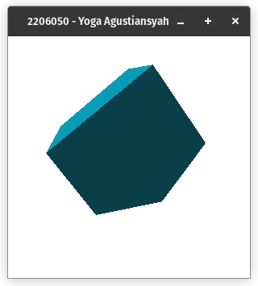
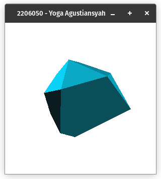
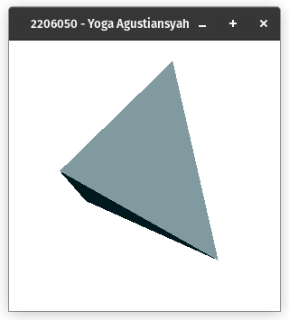
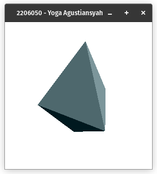
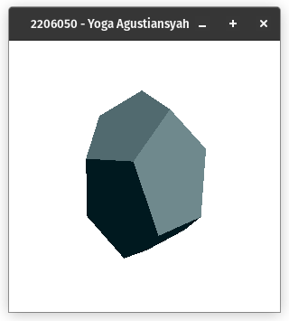
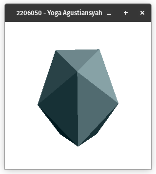
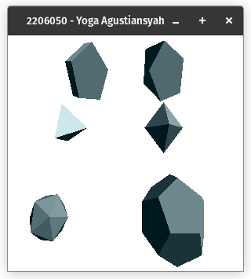

# 1. Buatlah program dengan OpenGL untuk menampilkan objek 3D dengan metoda 3 daftar yaitu (1) titik (2) normal (3) permukaan:   a) Prisma  b) Antiprisma  c) Tetrahedron  d) Octahedron  e) Dodecahedron  f) Icosahedron

## a) Prisma Segi Lima

Program ini menghasilkan sebuah prisma berbentuk segi lima. Prisma segi lima adalah bangun ruang tiga dimensi yang memiliki atap dan alas berbentuk segi lima dan memiliki selimut yang berbentuk persegi panjang pada 5 sisinya.

Program dimulai dengan mengimpor library GLUT dan mendefinisikan dua array GLfloat: light_diffuse dan light_position. light_diffuse digunakan untuk menentukan warna cahaya difus, dan light_position menentukan posisi cahaya.

Terdapat fungsi pentagonPrism yang digunakan untuk menggambar prisma segi lima. Di dalamnya, ada beberapa pemanggilan glBegin yang menentukan permukaan prisma dengan poligon berwarna merah dan biru. Setiap permukaan didefinisikan dengan menggunakan glNormal3f untuk menentukan arah normal permukaan, dan glColor3f untuk menentukan warna poligon.

Fungsi display digunakan untuk menggambar objek dan dipanggil dalam loop utama glut. Di sini, kita memanggil pentagonPrism untuk menggambar prisma.

Dalam fungsi init, beberapa pengaturan awal dilakukan, termasuk pengaturan latar belakang berwarna putih (glClearColor), pencahayaan difus (glLightfv), pengaturan buffer (glEnable(GL_DEPTH_TEST)), dan pengaturan proyeksi dan pandangan kamera.

Program utama dimulai dengan menginisialisasi GLUT, mengatur mode tampilan, membuat jendela, dan menjalankan loop utama GLUT. Di dalam loop, fungsi display akan dipanggil untuk menggambar objek pada jendela.

## b) AntiPrisma Segi Lima

Program ini menghasilkan sebuah antiprisma berbentuk segi lima. Antirisma segi lima adalah bangun ruang tiga dimensi yang memiliki sisi atap dan sisi alas berbentuk segi lima, namun pada salah satunya diputar sebesar 180 derajat terhadap sisi yang lain. Antiprisma segi lima memiliki selimut yang berbentuk segitiga sebanyak 5 pasang atas bawah yang saling terhubung dengan sisi alas dan sisi atas.

Fungsi pentagonAntiPrism digunakan untuk menggambar anti-prisma segi lima dengan beberapa sisi yang berbeda. Setiap sisi didefinisikan sebagai poligon menggunakan glBegin dan glEnd, dan masing-masing sisi memiliki warna dan arah normal yang berbeda.

Fungsi display digunakan untuk membersihkan buffer layar, menggambar anti-prisma dengan memanggil pentagonAntiPrism, dan menukar buffer untuk tampilan yang mulus.

Dalam fungsi init, beberapa pengaturan awal dilakukan, termasuk pengaturan latar belakang berwarna putih, pencahayaan difus, pengaturan buffer, dan proyeksi dan pandangan kamera.

Program utama dimulai dengan inisialisasi GLUT, pengaturan mode tampilan, pembuatan jendela, dan menjalankan loop utama GLUT. Program ini dapat digunakan sebagai dasar untuk membuat objek 3D yang lebih kompleks dalam bidang grafik komputer dan memahami konsep dasar rendering 3D dengan OpenGL.

Program utama dimulai dengan menginisialisasi GLUT, mengatur mode tampilan, membuat jendela, dan menjalankan loop utama GLUT. Di dalam loop, fungsi display akan dipanggil untuk menggambar objek pada jendela.

## c) Tetrahedron

Program ini menghasilkan sebuah antiprisma tetrahedron. Tetrahedron adalah bangun ruang tiga dimensi yang terdiri dari empat muka segitiga, enam garis rusuk yang lurus, dan empat titik sudut. Tetrahedron juga dikenal sebagai piramida segitiga karena memiliki alas berbentuk segitiga. 

Fungsi tetraHedron digunakan untuk menggambar tetrahedron. Pertama, program mengatur intensitas cahaya dan posisi cahaya. Kemudian, program mendefinisikan sifat-sifat material dari tetrahedron, seperti ambient, diffuse, specular, dan shininess. Setelah itu, tetrahedron digambar dengan menggunakan glutSolidTetrahedron. Tetrahedron tersebut dipindahkan, diputar, dan diubah ukurannya sebelum digambar.

Fungsi Display digunakan untuk membersihkan buffer layar, menggambar tetrahedron dengan memanggil tetraHedron, dan menukar buffer untuk tampilan yang mulus.

Dalam fungsi Inisial, beberapa pengaturan awal dilakukan, seperti mengatur tampilan OpenGL, pengaturan latar belakang berwarna putih, pengaturan proyeksi perspektif, pengaktifan pencahayaan, dan pengaturan lainnya yang diperlukan untuk rendering 3D.

## d) Octahedron

Program ini menghasilkan sebuah octahedron. Octahedron adalah bangun ruang tiga dimensi yang terdiri dari delapan muka segitiga yang sama besar. Setiap titik sudut octahedron bertemu dengan empat rusuk. 

## e) Dodecahedron

Program ini menghasilkan sebuah dodecahedron. Dodecahedron adalah bangun ruang tiga dimensi yang memiliki dua belas sisi atau muka. Dodecahedron yang paling terkenal adalah dodecahedron beraturan, yang memiliki dua belas pentagon beraturan sebagai mukanya dan dikategorikan sebagai bangun ruang Platonik. 

## f) Icosahedron

Program ini menghasilkan sebuah icosaHedron. Icosahedron adalah bangun ruang tiga dimensi yang memiliki 20 sisi atau muka. Icosahedron memiliki bentuk segitiga sama sisi pada setiap sisinya. Icosahedron merupakan salah satu dari lima bangun ruang Platonik, selain tetrahedron, kubus, oktahedron, dan dodecahedron.

## g) gabungan

