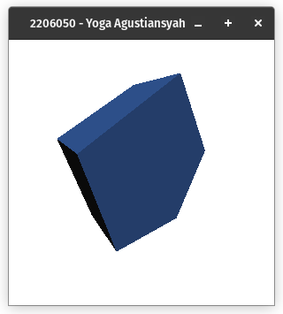
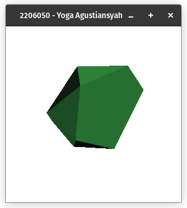
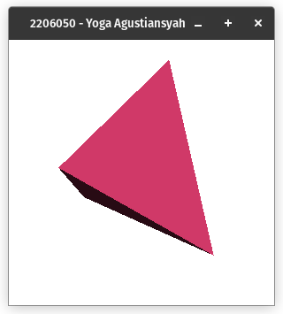
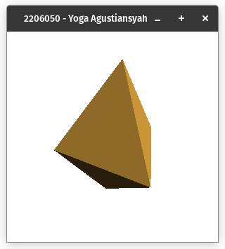
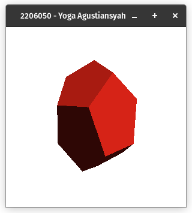
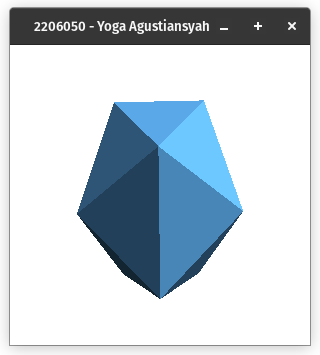
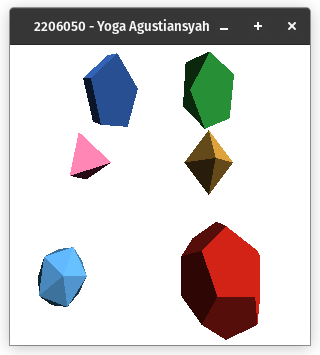

# 2. Modifikasi program sebelumnya dengan mengubah warna masing-masing polihendra dengan warna yang berbeda

## a) Prisma Segi Lima

Prisma segi lima diubah warnanya menjadi 

    rgba(55, 108, 200, 1)

## b) AntiPrisma Segi Lima

Warna anti prisma segi lima diubah menjadi 

    rgba(55, 200, 75, 1)

## c) Tetrahedron

Warna tetrahedron diubah menjadi

    rgba(200, 55, 180, 1)

## d) Octahedron

Warna octahedron diubah menjadi

    rgba(200, 147, 55, 1)

## e) Dodecahedron

Warna dodecahedron diubah menjadi

    rgba(231, 37, 24, 1)

## f) Icosahedron

Warna icosahedron diubah menjadi

    rgba(98, 183, 252, 1)

## g) gabungan

